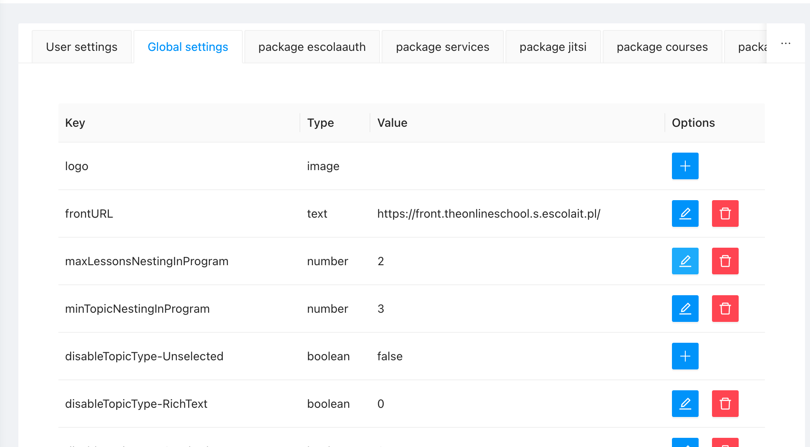

Tutorial how do setup minimum nesting of topics and maximum nesting of lessons.

---

# Program Nesting Configuration

Here is a simple tutorial how do setup minimum nesting of topics and maximum nesting of lessons.

By default Wellms structure is based on [Ulam format](https://escolalms.github.io/headless-format/#levels-of-granularity), which means that there is unlimited level of nesting of lessons:

Each lessons starting from root branch can have unlimited sub lessons (branches), each sub lessons can have unlimited sub sub lessons, etc.

```mermaid
flowchart TD
    A[Lesson] -->|Can have zero, one or many| A(Lesson)
    A[Lesson] -->|Can have zero, one or many| B(Topic)
```

Also each of those lessons can have number of units. This is a powerful structure, yet you can control this easily within admin panel settings.

Below is an example of default setup

<video src="./2023-04-04/ScreenRecording2023-04-11at11.57.00.mp4" autoplay loop muted />

Assuming we want to control this to have maximum 3 level of lessons nesting and that topics can be added only on the last lesson level.

```mermaid
flowchart TD
    A[Lesson level one] -->|Can have zero, one or many| B(Lesson level two)
    B[Lesson level one] -->|Can have zero, one or many| C(Lesson level three)
    C[Lesson level three] -->|Can have zero, one or many| D(Topic)
```

This achievable with admin panel settings (below are default values)

Amending default values with sample onces

would result in

<video src="./2023-04-04/ScreenRecording2023-04-11at11.53.18.mp4" autoplay loop muted />

<Disqus/>
