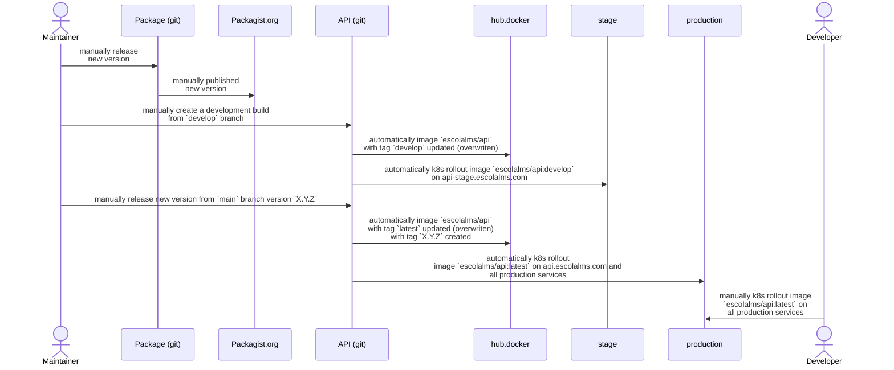

## Continuous integration (CI) i Continuous Delivery

### Backend

- backend is set of Laravel Package modules that are combined into Modularized Monolith within [API project](https://github.com/EscolaLMS/API)
- each package after creating new release on github is deployed automatically to packagist.org
- manually API releases docker image for development from `develop` branch into [escolalms/api:develop](https://hub.docker.com/r/escolalms/api/tags) image.
- After creating new release on github API releases docker image for production from `main` branch into [escolalms/api:latest](https://hub.docker.com/r/escolalms/api/tags) and [escolalms/api:version](https://hub.docker.com/r/escolalms/api/tags) image

