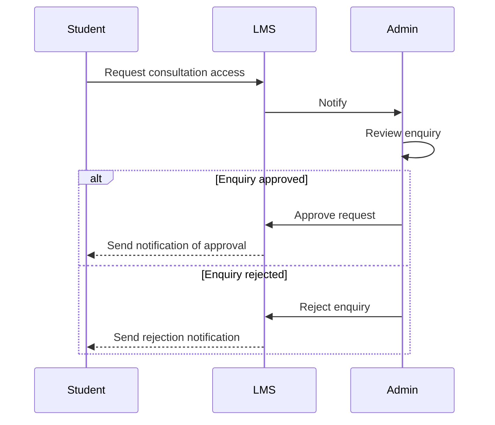

# Consultation Access

## What does it do

This package is used to create enquiries for free consultation access.  
Users with appropriate permissions can accept the enquiry and send a meeting link or reject the enquiry by sending a response message.

Consultation management is in our other package which is [here](https://github.com/EscolaLMS/Consultations).

## Installing

- `composer require escolalms/consultation-access`
- `php artisan migrate`
- `php artisan db:seed --class="EscolaLms\ConsultationAccess\Database\Seeders\ConsultationAccessPermissionSeeder"`

## Endpoints

The endpoints are defined in 

## Tests

Run `./vendor/bin/phpunit` to run tests. Test details 

## Events

- `ConsultationAccessEnquiryAdminCreatedEvent` - This event is dispatched when a user submits an enquiry for consultation. It includes the enquiry itself and the user who has authorization to approve it.
- `ConsultationAccessEnquiryAdminUpdatedEvent` - This event is dispatched when an enquiry is updated. It includes the author of the enquiry and the enquiry itself. Includes reason for refusal
- `ConsultationAccessEnquiryApprovedEvent` - This event is dispatched when an enquiry is approved.
- `ConsultationAccessEnquiryDisapprovedEvent` - This event is dispatched when an enquiry is disapproved (includes reason for refusal).

## Flow diagram

See the diagram below

If you don't send the `meeting_url` during the approval, an automatic space will be created in [Pencil Spaces](https://www.pencilspaces.com/), and that link will be saved. You can find more information [here](https://github.com/EscolaLMS/Pencil-Spaces).

## Listeners

This package does not listen for any events.

## Permissions

Permissions are defined in [seeder](https://github.com/EscolaLMS/Consultation-Access/blob/main/database/seeders/ConsultationAccessPermissionSeeder.php).
