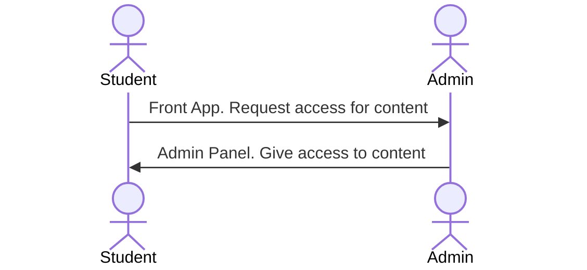
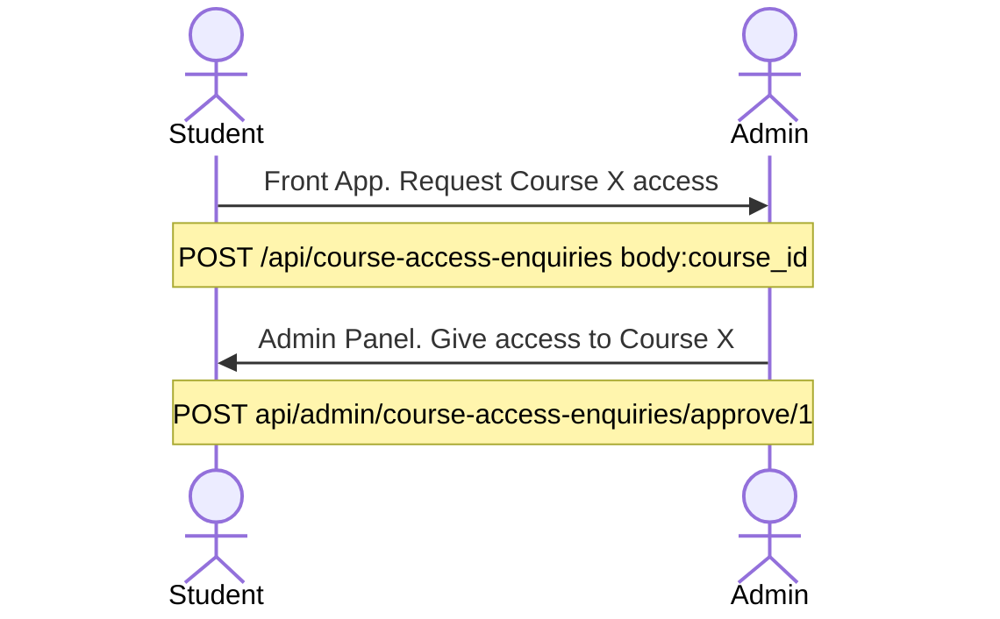
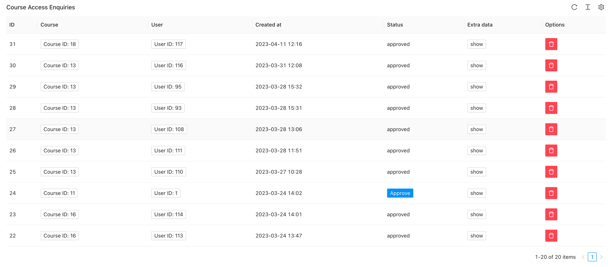
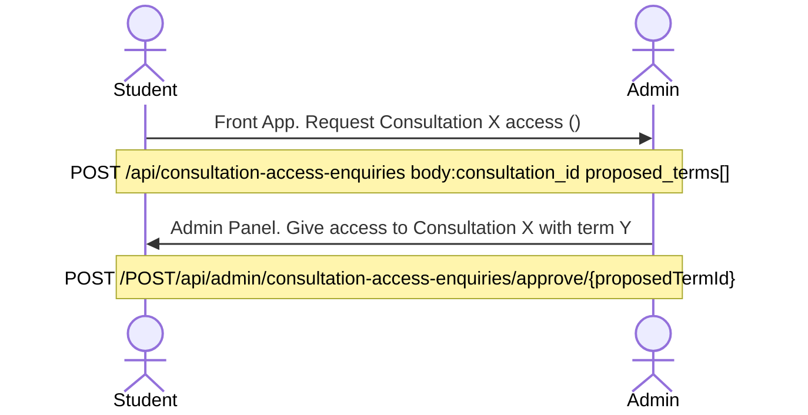
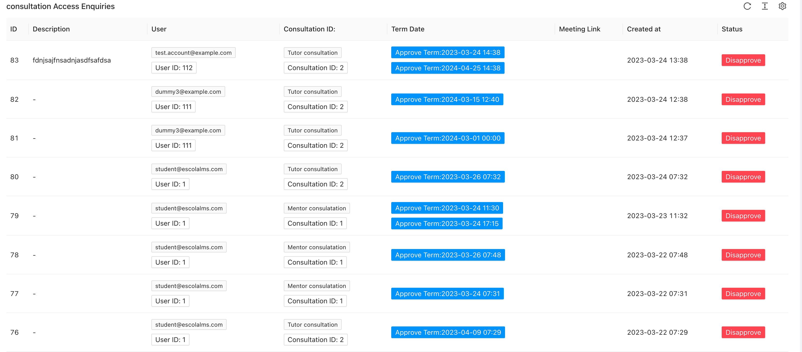

# Course & Consultation Access

<PostHeader/>

Here is a brief explanation of new features of new packages

- [Consultation-Access](https://github.com/EscolaLMS/Consultation-Access)
- [Course-Access](https://github.com/EscolaLMS/Course-Access)

## Access standard flow

The flow of both are similar.

1. Students asks for access to content: Course, Consultation, etc
2. Students can leave additional info (unstructured, send as `JSON`)
3. Admin/Tutor receives a notification
4. Admin/Tutor either accept or denies
5. Student receives Notification about result
6. Student got access to content



### Course Access

1. Students asks for access to Course
2. Students can leave additional info (unstructured, send as `JSON`)
3. Admin/Tutor receives a notification (email, push, sms)
4. Admin/Tutor either accept or denies (in Admin panel)
5. Student receives Notification about result
6. Student got access to content





### Consultation Access

1. Students asks for access to Course
2. Students can leave additional info (unstructured, send as `JSON`) and need to select at least on proposed term date
3. Admin/Tutor receives a notification (email, push, sms)
4. Admin/Tutor either accept ONE of term or denies all (in Admin panel)
5. Admin/Tutor fills meeting URL for student (optional)
6. Student receives Notification about result
7. Student got access to content



Student sends and request with list of proposed terms, optionally he selects with content this consultation relates to (eg Course).
Admin either selects one terms of many proposed by student or he declines.
Accepting term allows to send a URL with consultation (eg zoom link), dy default a random [meet.jit.si](https://meet.jit.si/) is generated. In admin reject he has option to hive rejection message description. Student receives all information as notification.

```json
{
  "consultation_id": 0,
  "description": "string",
  "title": "string",
  "related_type": "string",
  "related_id": 0,
  "proposed_terms": ["2023-04-11T14:53:12.590Z"]
}
```



<Disqus/>
