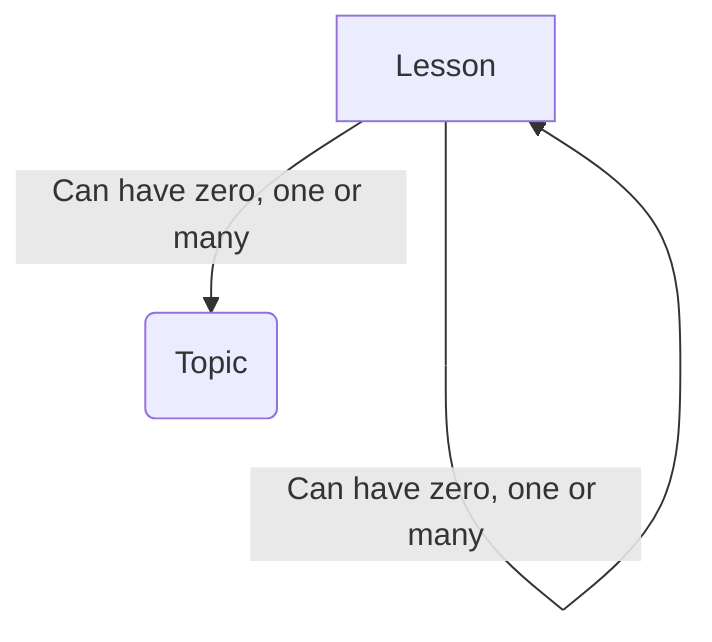
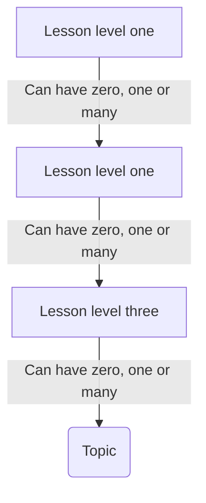
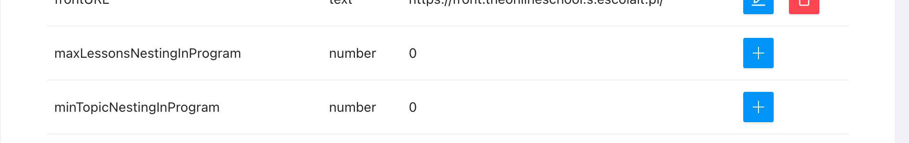
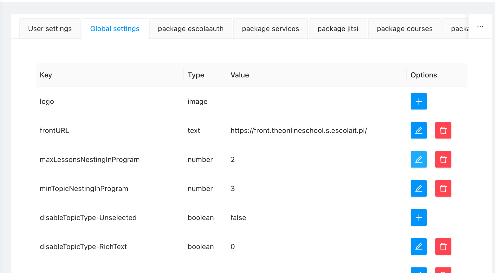

# Program Nesting Configuration

<PostHeader/>

Here is a simple tutorial how do setup minimum nesting of topics and maximum nesting of lessons.

By default Wellms structure is based on [Ulam format](https://escolalms.github.io/headless-format/#levels-of-granularity), which means that there is unlimited level of nesting of lessons:

Each lessons starting from root branch can have unlimited sub lessons (branches), each sub lessons can have unlimited sub sub lessons, etc.

Also each of those lessons can have number of units. This is a powerful structure, yet you can control this easily within admin panel settings.

Below is an example of default setup

<video src="./2023-04-04/Screen Recording 2023-04-11 at 11.57.00.mp4" autoplay loop muted />

Assuming we want to control this to have maximum 3 level of lessons nesting and that topics can be added only on the last lesson level.

This achievable with admin panel settings (below are default values)

Amending default values with sample onces

would result in

<video src="./2023-04-04/Screen Recording 2023-04-11 at 11.53.18.mp4" autoplay loop muted />

<Disqus/>
