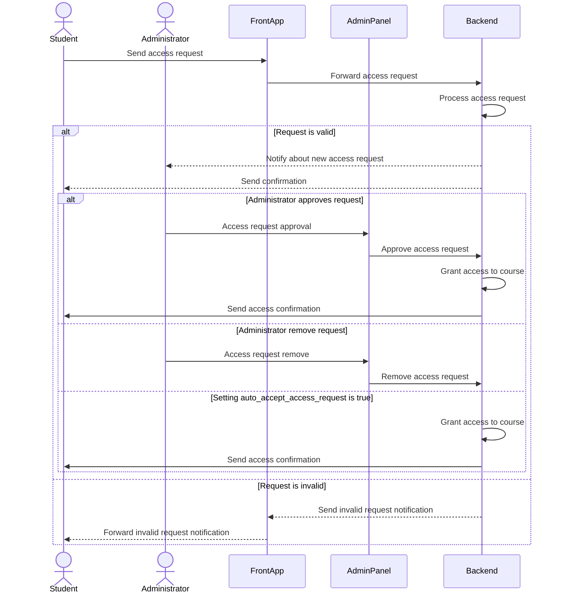

# Course Access

## What does it do

This package is used to manage access to the course for individual users and user groups. 

Additionally, it introduces a mechanism where users can send access enquiries with additional information, and administrators (users with appropriate permissions) can approve or remove them.

## Installing

- `composer require escolalms/course-access`
- `php artisan migrate`
- `php artisan db:seed --class="EscolaLms\CourseAccess\Database\Seeders\CourseAccessPermissionSeeder"`

## Endpoints

The endpoints are defined in 

## Tests

Run `./vendor/bin/phpunit` to run tests.
Test details 

## Events

### Course Access Enquiry
- `CourseAccessEnquiryAdminCreatedEvent` - This event is dispatched when a student creates an enquiry for course access.
- `CourseAccessEnquiryStudentCreatedEvent` - This event is dispatched to all users who have the `EnquiryStatusEnum::APPROVE_COURSE_ACCESS_ENQUIRY` permission, allowing them to approve the course access enquiry.

These events are listened to by the [escolalms/templates-email](https://github.com/EscolaLMS/Templates-Email/tree/main/src/CourseAccess) package, which sends emails based on its own logic. 
Additionally, notifications are stored in database.

### Course Access 
- `CourseAssigned` and `CourseAccessStarted` - These events are dispatched when a user is assigned access to a course. It contains information about the user and the course to which access has been granted.
- `CourseUnassigned` and `CourseFinished` - These events are dispatched when a user is denied access to a course.

The [escolalms/templates-email](https://github.com/EscolaLMS/Templates-Email/tree/main/src/Courses) package also listens to the above events.

## Course Access Enquiry - sequence diagram

## Permissions

Permissions are defined in [seeder](https://github.com/EscolaLMS/Course-Access/blob/main/database/seeders/CourseAccessPermissionSeeder.php).
